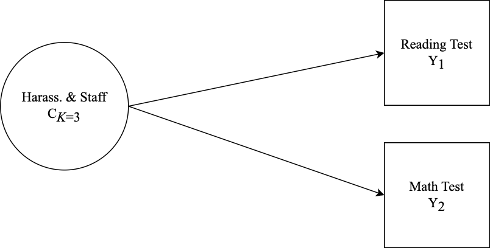
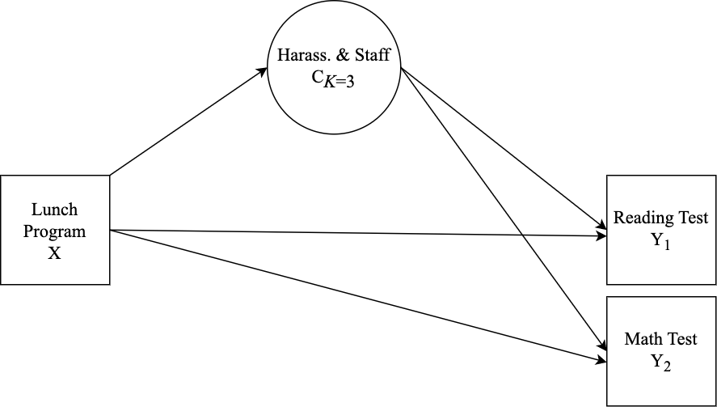
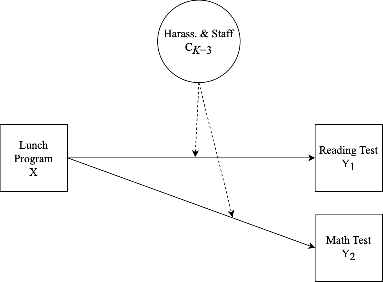

```{r setup, include=FALSE, eval=TRUE}
knitr::opts_chunk$set(eval = FALSE, echo = TRUE, message = FALSE, warning = FALSE) 
library(knitr); library(tidyverse); library(gt) 
```

# --------------------------------------------------------------------------------------

```{r, echo=FALSE, eval=TRUE, fig.align='center', out.width="40%"}
include_graphics("figures/IESNewLogo.jpg")
```

The Institute of Mixture Modeling for Equity-Oriented Researchers, Scholars, and Educators (`IMMERSE`) is an IES funded training grant (R305B220021) to support education scholars in integrating mixture modeling into their research.

> Visit our [$\color{blue}{\text{Website}}$](https://immerse.education.ucsb.edu/) to learn more about the IMMERSE project.

> Follow us on [$\color{blue}{\text{Twitter}}$](https://twitter.com/IMMERSE_UCSB) for updates on posted resources!

> Visit our [$\color{blue}{\text{GitHub}}$](https://github.com/immerse-ucsb/) account to follow along with this tutorial & others. 

# -------------------------------------------------------------------------------------- 

## What is included in this video tutorial?

> This tutorial covers the interpretation of the results of a mixture model with auxiliary variables. Specifically, an LCA model is specified with relations to covariate and distal outcomes in two examples. Auxiliary variable integration is specified using the 3-step ML auxiliary variable procedure using the `MplusAutomation` package (Hallquist & Wiley, 2018; Vermunt, 2010; Asparouhov & Muthén, 2014). In addition to running the models this tutorial covers plotting the results of distal outcome means and covariate relations in the context of moderation (see example; Nylund-Gibson et al., 2022). 

\newpage

# --------------------------------------------------------------------------------------

**Follow along! Link to `Github` repository:**

$\color{blue}{\text{https://github.com/immerse-ucsb/interpret-aux-vars}}$


# --------------------------------------------------------------------------------------

### Data Source: Civil Rights Data Collection (CRDC)

> The CRDC is a federally mandated school and district level data collection effort that occurs every other year. This public data is currently available for selected variables across 4 years (2011, 2013, 2015, 2017) and all US states. In the following tutorial six focal variables are utilized as indicators of the latent class model; three variables which report on harassment/bullying in schools based on disability, race, or sex, and three variables on full-time equivalent school staff employees (counselor, psychologist, law enforcement). For this example, we utilize a sample of schools from the state of Arizona reported in 2017.

**Information about CRCD:** https://www2.ed.gov/about/offices/list/ocr/data.html

**Data access (`R`):** https://github.com/UrbanInstitute/education-data-package-r

```{r, eval=TRUE, echo=FALSE}
### Take a look at the indicators that compose the LCA ###

table1 <- tribble(
~"Name", ~"Description", 
#----------|-------------|,
"report_dis"  , "Number of students harassed or bullied on the basis of disability" ,
"report_race" , "Number of students harassed or bullied on the basis of race, color, or national origin " ,
"report_sex" , "Number of students harassed or bullied on the basis of sex" ,
"counselors_fte"  , "Number of full time equivalent counselors hired as school staff" ,
"psych_fte"   , " Number of full time equivalent psychologists hired as school staff" ,
"law_fte"   , "Number of full time equivalent law enforcement officers hired as school staff" ,
"lunch_program"   , "School has a lunch program (0=No lunch program, 1=Lunch program at school).",
"read_test"   , "Average reading test assessment score at school",
"math_test" , "Average math test assessment score at school" ) %>% 
gt() %>% 
tab_header(title = md("**LCA Indicators & Auxiliary Variables: Harassment & Staff Example**"),
           subtitle = md("&nbsp;")) %>%
tab_row_group(group = "LCA Indicator Variables", rows = 1:6) %>% 
tab_row_group(group = "Auxiliary Variables", rows = 7:9) %>%
row_group_order(groups = c("LCA Indicator Variables","Auxiliary Variables")) %>% 
tab_options(column_labels.font.weight = "bold", row_group.font.weight = "bold") %>% 
tab_footnote(footnote = md("*Note*. Data souce is from the public-use dataset, the 
*Civil Rights Data Collection* (CRDC; US Department of Education Office for Civil Rights,
2014)"),locations = cells_title())

table1
```

```{r, echo=FALSE}
# Save the `gt()` table in the `figures` folder

gtsave(table1, here("figures","Variable_description.png"))
```

# --------------------------------------------------------------------------------------

Getting started: Load packages & Read in CSV data file from the `data` subfolder
```{r,eval=TRUE}
library(MplusAutomation) # Conduit between R & Mplus
library(glue)            # Pasting R code into strings
library(here)            # Location, location, location
library(tidyverse)       # Tidyness
```

```{r}

data_3step <- read_csv(here("data", "crdc_aux_data.csv"))

```

# --------------------------------------------------------------------------------------

## Auxiliary Variable Integration: Quickly Automate the "Manual 3-Step"!

# --------------------------------------------------------------------------------------

**Note:** Models `step1_3step.out` & `step2_3step.out` are labeled differently than in the technical documentation for the 3-step procedure. For example, in Asparouhov & Muthén (2014) this syntax corresponds to **steps 1-3**.
```{r}

m_step1  <- mplusObject(
  TITLE = "Step1  (MANUAL 3-STEP ML APPROACH)", 
  VARIABLE = 
   "categorical = report_dis report_race report_sex counselors_fte psych_fte law_fte; 
   
    usevar = report_dis report_race report_sex counselors_fte psych_fte law_fte;
    
    classes = c(3); 
    
    !!! All auxiliary variables to be considered in the final model should be listed here !!!
    auxiliary = 
    lunch_program title1_e title1_s read_test math_test;",
  
  ANALYSIS = 
   "estimator = mlr; 
    type = mixture; 
    starts = 500 100;
  
    !!! to replicate class order use, `optseed = 887580;` !!!",
  
  SAVEDATA = 
   "!!! This saved dataset will contain class probabilities and modal assignment columns !!!
    File=3step_savedata.dat;
    Save=cprob;
    Missflag= 999;",
  
  PLOT = 
    "type = plot3; 
    series = report_dis report_race report_sex counselors_fte psych_fte law_fte(*);",
  
  usevariables = colnames(data_3step),
  rdata = data_3step)

m_step1_fit <- mplusModeler(m_step1,
                 dataout=here("3step_mplus", "Step1_3step.dat"),
                 modelout=here("3step_mplus", "Step1_3step.inp") ,
                 check=TRUE, run = TRUE, hashfilename = FALSE)

# --------------------------------------------------------------------------------------
# Step 2 - Extract logits & saved data from the step 1 unconditional model. 
# --------------------------------------------------------------------------------------

logit_cprobs <- as.data.frame(m_step1_fit[["results"]]
                                         [["class_counts"]]
                                         [["logitProbs.mostLikely"]])

savedata <- as.data.frame(m_step1_fit[["results"]]
                                     [["savedata"]])

colnames(savedata)[colnames(savedata)=="C"] <- "N"

# --------------------------------------------------------------------------------------
# Step 2 (part 2) - Estimate the unconditional model with logits from step 2. 
# --------------------------------------------------------------------------------------

m_step2  <- mplusObject(
  TITLE = "Step2  (MANUAL 3-STEP ML APPROACH)", 
  
  VARIABLE = 
 "nominal=N;
  USEVAR = n;
  missing are all (999); 
  classes = c(3); ",
  
  ANALYSIS = 
 "estimator = mlr; 
  type = mixture; 
  starts = 0;",
  
  MODEL = 
    glue(
 "%C#1%
  [n#1@{logit_cprobs[1,1]}];
  [n#2@{logit_cprobs[1,2]}];
  
  %C#2%
  [n#1@{logit_cprobs[2,1]}];
  [n#2@{logit_cprobs[2,2]}];
  
  %C#3%
  [n#1@{logit_cprobs[3,1]}];
  [n#2@{logit_cprobs[3,2]}];"),
 
  usevariables = colnames(savedata), 
  rdata = savedata)

m_step2_fit <- mplusModeler(m_step2, 
                 dataout=here("3step_mplus", "Step2_3step.dat"), 
                 modelout=here("3step_mplus", "Step2_3step.inp"), 
                 check=TRUE, run = TRUE, hashfilename = FALSE)

```

# --------------------------------------------------------------------------------------

## EXAMPLE 1: Distal Outcome Model

```{r, echo=FALSE, eval=TRUE, fig.align='center', out.width="80%"}

```

# -------------------------------------------------------------------------------------

```{r}

m_step3  <- mplusObject(
  TITLE = "Distal Outcome Model (Step3)", 
  
  VARIABLE = 
 "nominal = N;
  usevar = n;
  missing are all (999); 
  
  usevar = read_tes math_tes;
  classes = c(3); ",

  ANALYSIS = 
 "estimator = mlr; 
  type = mixture; 
  starts = 0;",
  
  MODEL =
  glue(
 "!!! DISTAL OUTCOMES = read_tes math_tes !!!
  
  %OVERALL%
 
  read_tes;
  math_tes;

  %C#1%
  [n#1@{logit_cprobs[1,1]}];
  [n#2@{logit_cprobs[1,2]}];
  
  [read_tes](m01);               !!! estimate conditional intercept mean !!!
  read_tes;                      !!! estimate conditional intercept variance !!!

  [math_tes] (m1);
  math_tes;

  %C#2%
  [n#1@{logit_cprobs[2,1]}];
  [n#2@{logit_cprobs[2,2]}];
  
  [read_tes](m02);
  read_tes;

  [math_tes] (m2);
  math_tes;
  
  %C#3%
  [n#1@{logit_cprobs[3,1]}];
  [n#2@{logit_cprobs[3,2]}];
  
  [read_tes](m03);
  read_tes;

  [math_tes] (m3);
  math_tes;  "),
  
  MODELCONSTRAINT = 
 "New (rdiff12 rdiff13
  rdiff23 mdiff12 mdiff13
  mdiff23);

  rdiff12 = m1-m2;   mdiff12 = m01-m02;
  rdiff13 = m1-m3;   mdiff13 = m01-m03;
  rdiff23 = m2-m3;   mdiff23 = m02-m03;",
  
  MODELTEST =
  ## NOTE: Only a single Wald test can be conducted per model run. Therefore, 
  ## this example requires running separate models for each omnibus test (e.g.,
  ## 2 models for each outcome variable). This can be done by commenting out 
  ## all but one test and then estimating multiple versions of the model.
   
 "!m01=m02;    !!! Distal outcome omnibus Wald test for `read_tes` !!!
  !m02=m03;
  
  m1=m2;       !!! Distal outcome omnibus Wald test for `math_tes` !!!
  m2=m3; ",
 
  usevariables = colnames(savedata), 
  rdata = savedata)

m_step3_fit <- mplusModeler(m_step3,
                 dataout=here("3step_mplus", "EX1_Distal_Model.dat"), 
                 modelout=here("3step_mplus", "EX1_Distal_Model.inp"), 
                 check=TRUE, run = TRUE, hashfilename = FALSE)
```

# --------------------------------------------------------------------------------------

## EX1: Distal Outcome Plot

# --------------------------------------------------------------------------------------

**Note**: The distal outcome means are estimated at the average of the covariate (`lunch_pr`). This is specified by centering lunch program as shown in the `Step-3` model syntax. 

This syntax reads in the `Step3` model & extract model parameter estimates.
```{r, eval=TRUE}
model_step3 <- readModels(here("3step_mplus", "EX1_Distal_Model.out"), quiet = TRUE)
  
model_step3 <- data.frame(model_step3$parameters$unstandardized)

```

This syntax is used to create the `data-frame` that produces the distal outcome bar plot.
```{r, eval=TRUE}

distal_data <- model_step3 %>% 
  filter(paramHeader == "Means") %>% 
  filter(param == c("READ_TES","MATH_TES")) %>%
  mutate(param = case_when(
      param == "READ_TES" ~ "Reading Test",
      param == "MATH_TES" ~ "Math Test")) %>% 
  mutate(LatentClass = factor(LatentClass,
      labels = c("Reported Harrasement (Low), Staff (High)",
                 "Reported Harrasement (High), Staff (Low)",
                 "Reported Harrasement (Low), Staff (Low)"))) %>% 
  mutate(value_labels = round(est,2))
  
```

## Plot distal outcomes grouped by class 
```{r, eval=TRUE}
library(cowplot)
library(reshape2) 

ggplot(distal_data, 
       aes(fill=LatentClass, y=est, x=fct_rev(param))) + 
  geom_bar(position="dodge", stat="identity", color="black", size=.3) + 
  geom_errorbar( aes(ymin=est-se, ymax=est+se),
                 width=.2, position=position_dodge(.9)) +
  geom_text(aes(y = est -5, label = value_labels),
            size=4, position=position_dodge(.9)) +
  theme_cowplot() +
  labs(x = "", y = "Mean Value", fill = "Latent Class") +
  theme(text=element_text(size=12),
        axis.text.x=element_text(size=10)) +
        coord_cartesian(expand = FALSE)

```

```{r}
ggsave(here("figures","EX1_Distal_barplot.png"), dpi=300, height=3, width=6, units="in")  
```

# --------------------------------------------------------------------------------------

## EXAMPLE 2: Distal Outcome Model with Covariate Control.

```{r, echo=FALSE, eval=TRUE, fig.align='center', out.width="80%"}

```

# --------------------------------------------------------------------------------------

**Specification details:**

- This example contains two distal outcomes (`read_test` & `math_test`) and one binary covariate (`lunch_program`).
- Under each class-specific statement (e.g., `%C#1%`) the distal outcome means & variances are mentioned to allow these parameters to vary by class. 
- Note that the binary covariate is centered so that reported distal means (intercepts) are estimated at the average of `lunch_program`.

```{r}

m_step3  <- mplusObject(
  TITLE = "Distal Outcome Model with Control Covariate (Step3)", 
  
  VARIABLE = 
 "nominal = N;
  usevar = n;
  missing are all (999); 
  
  usevar = lunch_pr read_tes math_tes;
  classes = c(3); ",
 
  DEFINE =
 "Center lunch_pr (Grandmean);",
  
  ANALYSIS = 
 "estimator = mlr; 
  type = mixture; 
  starts = 0;",
  
  MODEL =
  glue(
 "!!! DISTAL OUTCOMES = read_tes math_tes !!!
  !!! COVARIATE = lunch_pr !!!
  
  %OVERALL%
  c on lunch_pr;                 !!! estimate covariate as predictor of latent class !!!
 
  read_tes on lunch_pr;          !!! estimate the direct effect of Y on X !!!
  math_tes on lunch_pr;
 
  read_tes;
  math_tes;

  %C#1%
  [n#1@{logit_cprobs[1,1]}];
  [n#2@{logit_cprobs[1,2]}];
  
  [read_tes](m01);               !!! estimate conditional intercept mean !!!
  read_tes;                      !!! estimate conditional intercept variance !!!

  [math_tes] (m1);
  math_tes;

  %C#2%
  [n#1@{logit_cprobs[2,1]}];
  [n#2@{logit_cprobs[2,2]}];
  
  [read_tes](m02);
  read_tes;

  [math_tes] (m2);
  math_tes;
  
  %C#3%
  [n#1@{logit_cprobs[3,1]}];
  [n#2@{logit_cprobs[3,2]}];
  
  [read_tes](m03);
  read_tes;

  [math_tes] (m3);
  math_tes;  "),
  
  MODELCONSTRAINT = 
 "New (rdiff12 rdiff13
  rdiff23 mdiff12 mdiff13
  mdiff23);

  rdiff12 = m1-m2;   mdiff12 = m01-m02;
  rdiff13 = m1-m3;   mdiff13 = m01-m03;
  rdiff23 = m2-m3;   mdiff23 = m02-m03;",
  
  MODELTEST =
  ## NOTE: Only a single Wald test can be conducted per model run. Therefore, 
  ## this example requires running separate models for each omnibus test (e.g.,
  ## 2 models for each outcome variable). This can be done by commenting out 
  ## all but one test and then estimating multiple versions of the model.
   
 "!m01=m02;    !!! Distal outcome omnibus Wald test for `read_tes` !!!
  !m02=m03;
  
  m1=m2;       !!! Distal outcome omnibus Wald test for `math_tes` !!!
  m2=m3;       

 ",
 
  usevariables = colnames(savedata), 
  rdata = savedata)

m_step3_fit <- mplusModeler(m_step3,
                 dataout=here("3step_mplus", "EX2_Dist_Cov_Model.dat"), 
                 modelout=here("3step_mplus", "EX2_Dist_Cov_Model.inp"), 
                 check=TRUE, run = TRUE, hashfilename = FALSE)
```

# --------------------------------------------------------------------------------------

## EX2: Distal Outcome Plot

# --------------------------------------------------------------------------------------

**Note**: The distal outcome means are estimated at the average of the covariate (`lunch_pr`). This is specified by centering lunch program as shown in the `Step-3` model syntax. 

This syntax reads in the `Step3` model & extract model parameter estimates.
```{r, eval=TRUE}
model_step3 <- readModels(here("3step_mplus", "EX2_Dist_Cov_Model.out"), quiet = TRUE)
  
model_step3 <- data.frame(model_step3$parameters$unstandardized)

```

This syntax is used to create the `data-frame` that produces the distal outcome bar plot.
```{r, eval=TRUE}

distal_data <- model_step3 %>% 
  filter(paramHeader == "Intercepts") %>% 
  filter(param == c("READ_TES","MATH_TES")) %>%
  mutate(param = case_when(
      param == "READ_TES" ~ "Reading Test",
      param == "MATH_TES" ~ "Math Test")) %>% 
  mutate(LatentClass = factor(LatentClass,
      labels = c("Reported Harrasement (Low), Staff (High)",
                 "Reported Harrasement (High), Staff (Low)",
                 "Reported Harrasement (Low), Staff (Low)"))) %>% 
  mutate(value_labels = round(est,2))
  
```

## Plot distal outcomes grouped by class 
```{r, eval=TRUE}

ggplot(distal_data, 
       aes(fill=LatentClass, y=est, x=fct_rev(param))) + 
  geom_bar(position="dodge", stat="identity", color="black", size=.3) + 
  geom_errorbar( aes(ymin=est-se, ymax=est+se),
                 width=.2, position=position_dodge(.9)) +
  geom_text(aes(y = est -4, label = value_labels),
            size=4, position=position_dodge(.9)) +
  theme_cowplot() +
  labs(x = "", y = "Mean Value", fill = "Latent Class") +
  theme(text=element_text(size=12),
        axis.text.x=element_text(size=10)) +
        coord_cartesian(expand = FALSE)

```

```{r}
ggsave(here("figures","EX2_Distal_barplot.png"), dpi=300, height=3, width=6, units="in")  
```

# --------------------------------------------------------------------------------------

## EXAMPLE 3: Moderation Model

```{r, echo=FALSE, eval=TRUE, fig.align='center', out.width="80%"}

```

# --------------------------------------------------------------------------------------

**Specification details:**

- This example contains two distal outcomes (`read_test` & `math_test`) and one binary covariate (`lunch_program`).
- Under each class-specific statement (e.g., `%C#1%`) the distal outcome means & variances are mentioned to allow these parameters to vary by class. 
- Moderation is specified by mentioning the `"outcome ON covariate;"` syntax under each of the class-specific statements. 
- Note that the binary covariate is centered so that reported distal means (intercepts) are estimated at the average of `lunch_program`.

```{r}

m_step3  <- mplusObject(
  TITLE = "Step3  (MANUAL 3-STEP ML APPROACH)", 
  
  VARIABLE = 
 "nominal = N;
  usevar = n;
  missing are all (999); 
  
  usevar = lunch_pr read_tes math_tes;
  classes = c(3); ",
 
  DEFINE =
 "Center lunch_pr (Grandmean);",
  
  ANALYSIS = 
 "estimator = mlr; 
  type = mixture; 
  starts = 0;",
  
  MODEL =
  glue(
 "!!! OUTCOMES = read_tes math_tes !!! 
  !!! COVARIATE = lunch_pr !!! 
  !!! MODERATOR = C !!!
  
  %OVERALL%
  read_tes on lunch_pr;
  read_tes;
  
  math_tes on lunch_pr;
  math_tes;

  %C#1%
  [n#1@{logit_cprobs[1,1]}];
  [n#2@{logit_cprobs[1,2]}];
  
  [read_tes](m01);
  read_tes;                    !!! estimate conditional intercept !!!
  read_tes on lunch_pr (s01);    !!! estimate conditional regression !!!

  [math_tes] (m1);
  math_tes;
  math_tes on lunch_pr (s1);

  %C#2%
  [n#1@{logit_cprobs[2,1]}];
  [n#2@{logit_cprobs[2,2]}];
  
  [read_tes](m02);
  read_tes;
  read_tes on lunch_pr (s02);

  [math_tes] (m2);
  math_tes;
  math_tes on lunch_pr (s2);
  
  %C#3%
  [n#1@{logit_cprobs[3,1]}];
  [n#2@{logit_cprobs[3,2]}];
  
  [read_tes](m03);
  read_tes;
  read_tes on lunch_pr (s03);

  [math_tes] (m3);
  math_tes;
  math_tes on lunch_pr (s3);"),
  
  MODELCONSTRAINT = 
 "New (rdiff12 rdiff13
  rdiff23 rslope12 rslope13
  rslope23 mdiff12 mdiff13
  mdiff23 mslope12 mslope13
  mslope23);

  rdiff12 = m1-m2;   mdiff12 = m01-m02;
  rdiff13 = m1-m3;   mdiff13 = m01-m03;
  rdiff23 = m2-m3;   mdiff23 = m02-m03;
  rslope12 = s1-s2;  mslope12 = s01-s02;
  rslope13 = s1-s3;  mslope13 = s01-s03;
  rslope23 = s2-s3;  mslope23 = s02-s03;",
  
  MODELTEST =
  ## NOTE: Only a single Wald test can be conducted per model run. Therefore, 
  ## this example requires running separate models for each omnibus test (e.g.,
  ## 4 models; 2 outcomes and 2 slope coefficients). This can be done by
  ## commenting out all but one test and then estimating multiple versions of the model.
   
 "!m01=m02;    !!! Distal outcome omnibus Wald test for `read_tes` !!!
  !m02=m03;

  !s01=s02;   !!! Slope difference omnibus Wald test for `read_tes on lunch_pr` !!!
  !s02=s03;
  
  m1=m2;       !!! Distal outcome omnibus Wald test for `math_tes` !!!
  m2=m3;       

  !s1=s2;      !!! Slope difference omnibus Wald test `math_tes on lunch_pr` !!!
  !s2=s3; ",
 
  usevariables = colnames(savedata), 
  rdata = savedata)

m_step3_fit <- mplusModeler(m_step3,
                 dataout=here("3step_mplus", "EX3_Moderation_Model.dat"), 
                 modelout=here("3step_mplus", "EX3_Moderation_Model.inp"), 
                 check=TRUE, run = TRUE, hashfilename = FALSE)
```

# --------------------------------------------------------------------------------------

### Estimate step 3 moderation model with covariate un-centered to produce simple-slopes plots 

- Intercepts are estimated at the reference level of the covariate (i.e., `lunch_pr = 0`)

**Note:** Here the `update()` function is used to take the previous model and remove the Mplus syntax within the `DEFINE` statement that was used to center the covariate `Lunch Program`. Next, the updated model input syntax is used to estimate a new model. To learn more about the `update` function see the `MplusAutomation` tutorial article (https://www.tandfonline.com/doi/pdf/10.1080/10705511.2017.1402334).

```{r}
m_uncen <- update(m_step3,
  DEFINE = ~" ") # This update removes the centering syntax from the model object `m_step3`

m_uncen_fit <- mplusModeler(m_uncen,
                            dataout=here("3step_mplus", "EX3_Uncentered.dat"), 
                            modelout=here("3step_mplus", "EX3_Uncentered.inp"), 
                            check=TRUE, run = TRUE, hashfilename = FALSE)
```

# --------------------------------------------------------------------------------------

## EX3: Distal Outcome Plot

# --------------------------------------------------------------------------------------

This syntax reads in the `Step3` model & extract model parameter estimates.
```{r, eval=TRUE}
model_step3 <- readModels(here("3step_mplus", "EX3_Moderation_Model.out"), quiet = TRUE)
  
model_step3 <- data.frame(model_step3$parameters$unstandardized)

```

This syntax is used to create the `data-frame` that produces the distal outcome bar plot.
```{r, eval=TRUE}

distal_data <- model_step3 %>% 
  filter(paramHeader == "Intercepts") %>% 
  mutate(param = case_when(
      param == "READ_TES" ~ "Reading Test",
      param == "MATH_TES" ~ "Math Test")) %>% 
  mutate(LatentClass = factor(LatentClass,
      labels = c("Reported Harrasement (Low), Staff (High)",
                 "Reported Harrasement (High), Staff (Low)",
                 "Reported Harrasement (Low), Staff (Low)"))) %>% 
  mutate(value_labels = c("36.4a", "36.3a", "44.5b", "42.8b", "44.9b", "43.4b"))
  
```

## Plot distal outcomes grouped by class 
```{r, eval=TRUE}

ggplot(distal_data, 
       aes(fill=LatentClass, y=est, x=fct_rev(param))) + 
  geom_bar(position="dodge", stat="identity", color="black", size=.3) + 
  geom_errorbar( aes(ymin=est-se, ymax=est+se),
                 width=.2, position=position_dodge(.9)) +
  geom_text(aes(y = est -4, label = value_labels),
            size=4, position=position_dodge(.9)) +
  #scale_fill_grey(start = 0.6, end = 1.0) +
  theme_cowplot() +
  labs(x = "", y = "Mean Value", fill = "Latent Class") +
  theme(text=element_text(size=12),
        axis.text.x=element_text(size=10)) +
        coord_cartesian(expand = FALSE)

```

```{r}
ggsave(here("figures","EX3_Distal_barplot.png"), dpi=300, height=3, width=6, units="in")  
```


# --------------------------------------------------------------------------------------

## EX3: Simple Slope Plots

**Note:** The un-centered distal intercepts represent the conditional means when the binary covariate is at its first level `lunch_pr = 0` (i.e., school does not have a lunch program). Therefore, the conditional mean for `lunch_pr = 1`  (i.e., school has lunch program) can be calculated by adding the associated slope coefficient to the intercept. 

# --------------------------------------------------------------------------------------

Read in the un-centered model & extract relevant parameters
```{r, eval=TRUE}
model_uncen <- readModels(here("3step_mplus", "EX3_Uncentered.out"), quiet = TRUE)
  
model_uncen <- data.frame(model_uncen$parameters$unstandardized)

slope_data <- model_uncen %>% 
  filter(str_detect(paramHeader, 'ON|Inter'))%>% 
  unite("param", paramHeader:param, remove = TRUE) %>% 
  mutate(param = str_replace(param, "TES.ON_LUNCH_PR", "COEF")) %>% 
  mutate(param = str_remove_all(param, "Intercepts_|_TES")) %>% 
  mutate(LatentClass = factor(LatentClass,
    labels = c("Rep. Harrasement (Low), Staff (High)",
               "Rep. Harrasement (High), Staff (Low)",
               "Rep. Harrasement (Low), Staff (Low)")))

```

# --------------------------------------------------------------------------------------

## Reading test simple slope graph

# --------------------------------------------------------------------------------------

Prepare `data-frame` for plotting
```{r, eval=TRUE}

read_data <- slope_data %>% 
  filter(str_detect(param, 'READ')) 

read_wide <- read_data %>%
  select(param,est, LatentClass) %>% 
  pivot_wider(names_from = param, values_from = est) %>% 
  rename("No.Lunch.Program" = 'READ') %>% 
  mutate(Lunch.Program = No.Lunch.Program + READ_COEF) %>% # calc. condit. means `LUNCH_PR = 1`
  select(-READ_COEF)

read_pos <- melt(read_wide, id.vars = "LatentClass") %>% 
  mutate(variable = factor(variable,
                      levels = c("No.Lunch.Program","Lunch.Program"),
                      labels = c("No Lunch Program","Lunch Program")))

```

Plot positive mood simple slope graph
```{r, eval=TRUE}
p_plot <- ggplot(read_pos,
            aes(y=value, x=variable,
                color=LatentClass,
                group=LatentClass,
                shape=LatentClass,
                lty=LatentClass)) + 
  geom_point(size = 4) + geom_line() + 
  xlab("") + ylab("Reading Test")  +
  theme_classic() + 
  theme(text=element_text(size=12), 
        axis.text.x=element_text(size=12),
        legend.text = element_text(size=8),
        legend.position = "right", legend.title = element_blank()) 

```


# --------------------------------------------------------------------------------------

## Negative mood simple slope graph 

# --------------------------------------------------------------------------------------

Prepare `data-frame` for plotting
```{r, eval=TRUE}

math_data <- slope_data %>% 
  filter(str_detect(param, 'MATH')) 

math_wide <- math_data %>%
  select(param,est, LatentClass) %>% 
  pivot_wider(names_from = param, values_from = est) %>% 
  rename("No.Lunch.Program" = 'MATH') %>% 
  mutate(Lunch.Program = No.Lunch.Program + MATH_COEF) %>%   # calculate means for `Lunch.Program = 1`
  select(-MATH_COEF)

plot_math <- melt(math_wide, id.vars = "LatentClass") %>% 
  mutate(variable = factor(variable,
                      levels = c("No.Lunch.Program","Lunch.Program"),
                      labels = c("No Lunch Program","Lunch Program")))

```

Plot negative mood simple slope graph
```{r, eval=TRUE}
n_plot <- ggplot(plot_math,
            aes(y=value, x=variable,
            color=LatentClass,
            group=LatentClass,
            shape=LatentClass,
            lty=LatentClass)) + 
  geom_point(size=4) + geom_line() + 
  xlab("") + ylab("Math Test") + 
  theme_classic() +
  theme(text=element_text(color = "black", size=12),
        axis.text.x=element_text(size=12),
        legend.text = element_text(size=8),
        legend.position = "right", legend.title = element_blank()) 

```

# --------------------------------------------------------------------------------------

## Combine the two simple slopes graphs for distal outcomes positive & negative mood

```{r, eval=TRUE, fig.align='center', fig.width = 8, fig.height = 6}

library(patchwork) 

p_plot / n_plot # combines plots using the {patchwork} package

```

```{r}
ggsave(here("figures", "EX3_Simple_slopes.png"), dpi=300, height=8.5, width=6.5, units="in")
```

# --------------------------------------------------------------------------------------

## References

# --------------------------------------------------------------------------------------

Asparouhov, T., & Muthén, B. O.
(2014). 
Auxiliary variables in mixture modeling: Three-step approaches using Mplus. 
Structural Equation Modeling, 21, 329–341. http://dx.doi.org/10.1080/10705511.2014.915181

Hallquist, M. N., & Wiley, J. F.
(2018).
MplusAutomation: An R Package for Facilitating Large-Scale Latent Variable Analyses in Mplus.
Structural equation modeling: a multidisciplinary journal, 25(4), 621-638.

Müller, Kirill. 
(2017).
Here: A Simpler Way to Find Your Files. 
https://CRAN.R-project.org/package=here.

Muthén, B. O., Muthén, L. K., & Asparouhov, T.
(2017).
Regression and mediation analysis using Mplus.
Los Angeles, CA: Muthén & Muthén.

Muthén, L.K.
and Muthén, B.O.
(1998-2017).
Mplus User's Guide.
Eighth Edition. Los Angeles, CA: Muthén & Muthén

Nylund-Gibson, K., Garber, A. C., Singh, J., Witkow, M. R., Nishina, A., & Bellmore, A. (2023).
The utility of latent class analysis to understand heterogeneity in youth coping strategies: A methodological introduction. 
Behavioral Disorders, 48(2), 106-120.


R Core Team (2017).
R: A language and environment for statistical computing.
R Foundation for Statistical Computing, Vienna, Austria.
URL <http://www.R-project.org/>

Vermunt, J. K. (2010). 
Latent class modeling with covariates: Two improved three-step approaches. 
Political Analysis, 450–469. https://doi.org/10.1093/pan/mpq025

US Department of Education Office for Civil Rights.
(2014). 
Civil rights data collection data snapshot: School discipline. 
Issue brief no. 1.

Wickham et al., (2019).
Welcome to the tidyverse.
Journal of Open Source Software, 4(43), 1686, <https://doi.org/10.21105/joss.01686>

# --------------------------------------------------------------------------------------

